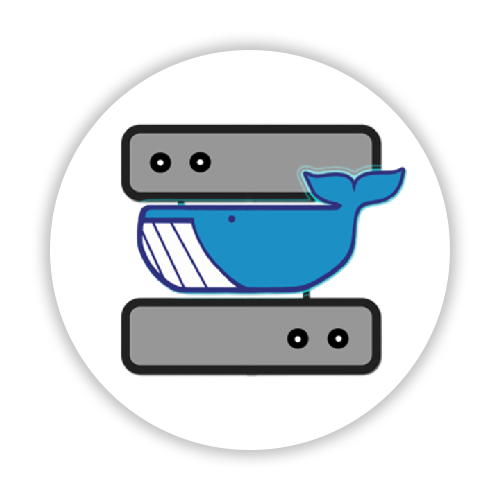

<!-- PROJECT LOGO -->
<br />
<p align="center">
  <a href="LOGO.png">
    
  </a>

  <h3 align="center">Remote-Whale</h3>

  <p align="center">
    A simple script to simplify running containers remotely.
    <br />
    <a href="https://github.com/othneildrew/Best-README-Template"><strong>Explore the docs »</strong></a>
    <br />
    <br />
    <a href="https://github.com/othneildrew/Best-README-Template">View Demo</a>
    ·
    <a href="https://github.com/othneildrew/Best-README-Template/issues">Report Bug</a>
    ·
    <a href="https://github.com/othneildrew/Best-README-Template/issues">Request Feature</a>
  </p>
</p>

## Table of Contents

* [About the Project](#about-the-project)
* [Getting Started](#getting-started)
  * [Prerequisites](#prerequisites)
  * [Installation](#installation)
* [Usage](#usage)
* [License](#license)
* [Acknowledgements](#acknowledgements)

### About the Project
Even though this project may seem too simple for some, there are many people that can benefit from running code on a separate machine. The idea of Remote-Whale is to allow users that may not even know about the existence of [docker](https://docker.com) to easily and quickly run containers on separate machines, without the need to move away from their precious Text Editor or IDE.

Remote-Whale mounts the current folder (`$PWD`) to the `usr/src` directory inside the docker container in your docker-host.

An example of that may be statisticians, that normally run very resource intensive code, but may have difficulties setting up a separate environment, as learning about docker is not in their direct study field.

The body of this project is the [vieux/docker-volume-sshfs](https://github.com/vieux/docker-volume-sshfs) plugin, you can even say that Remote-Whale is nothing but a wrapper for his plugin.

### Getting Started
#### Prerequisites
Before running the Remote-Whale script, you will need to have a few things enabled:

##### On your local computer:
* [SSH access](https://en.wikipedia.org/wiki/Secure_Shell) must be enabled (just look up how to enable it for your OS, it is generally very simple)
* [expect scripts](https://en.wikipedia.org/wiki/Expect)

##### On the Server you will use to run your code (docker host):
* [docker](https://docker.com)
* [SSH access](https://en.wikipedia.org/wiki/Secure_Shell) must be enabled
* [vieux/docker-volume-sshfs](https://github.com/vieux/docker-volume-sshfs)

#### Installation
As of now, Remote-Whale is nothing but script files. After installing the dependencies, you'll need to run the installation script. To do so, run:
```sh
git clone https://github.com/LombardiDaniel/remote-whale.git

cd remote-whale

chmod +x install-remote-whale.sh && ./install-remote-whale.sh
```


To use it, all you have to do is use the  `-n` flag and specify the base image docker will pull from [docker-hub](https://hub.docker.com) to build your container.
For Archlinux, it would look like:
```sh
remote-whale -n archlinux
```

Use only `remote-whale` if you wish to use your previous image, this is useful for keeping installed libraries from your last usage.
#### Installation
* Hat tip to everyone who's code I used!
